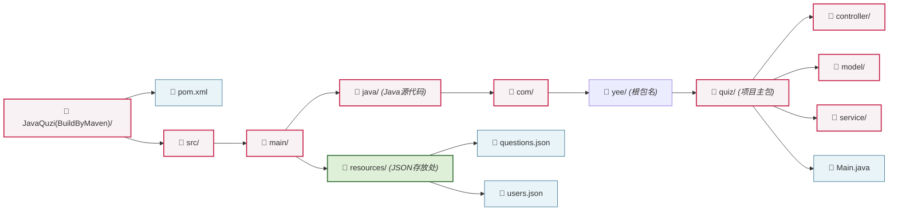

# 题目描述

### Java知识在线测试系统

**一、核心任务内容**m

​	本任务要求开发一款单机版Java知识在线测试系统（类似驾考科一自主测试的运行方式），实现管理员题库管理、学生在线测试、自动判分等核心功能，结合个性化附加任务，全面运用大一Java所学知识点，完成完整的控制台版(单机版)程序。

 

**二、核心功能要求**

1. 角色划分：教师、学生两个角色，分别实现对应功能，账号信息存入MySQL数据库。
2. 登录注册模块：学生可注册账号、登录系统；管理员使用固定账号登录，完成题库管理。
3. 题库管理（管理员）：录入单选题、判断题，包含题干、选项、正确答案，支持题目增删改查，可对题目进行分类（如Java基础、集合、IO等）。
4. 测试模块（学生）：学生登录后进入考试界面，选择开始测试（或选择退出）后，采用随机抽题组卷并逐题展示（可事先由管理员设置考试题目数量（如单选10题+判断5题），每份试卷总分80分，利用List/Set集合随机抽题、打乱题目顺序，确保每位学生考试题目顺序不同）。学生输入选项作答，不可跳过题目，答题完毕后提交试卷。
5. 自动判分模块：系统自动比对考生答案与题库标准答案，计算总分、正确率，显示错题及简易解析提示。
6. 成绩管理模块：考试结束后，自动将学号、姓名、分数、考试时间、答题用时存入数据库；学生可查询个人历史成绩，可以按时间或分数排序查询。

 

**三、** **个性化附加任务（任选1-5个完成）**

1. 考试限时功能：管理员可设置考试时长（如30分钟），系统自动计时，每做1题或每隔5分钟提示剩余时间，超时自动提交试卷，计时功能需使用日期API实现。
2. 按章节抽题：题库中为每个题目添加“章节”属性（如Java基础、集合、IO、数据库），学生考试时可选择指定章节抽题，或按比例从不同章节抽题。
3. 批量导入题目：使用IO流读取本地txt文件（格式：题干|选项A|选项B|选项C|选项D|正确答案|题目类型），实现题目批量录入题库，减少手动录入工作量。
4. 答题记录导出：学生可将自己的某次考试答题记录（题干、自己答案、正确答案、得分）通过IO流导出为txt文件，便于留存查看。
5. 密码修改功能：学生和管理员均可修改自己的登录密码，修改后密码加密（简单加密即可，如字符串反转）存入数据库，防止密码明文存储。

# 需求分析

计划此答题系统采用控制台交互模式

## 1. 子任务分析

- 数据库管理：系统启动时加载题库与用户数据，答题结束后更新用户数据（答题时间，分数）保存回文件。
- 用户模块：实现用户的登录，注册功能。
- 答题模块：读取并展示题目，接收用户输入的答案，判分计算

## 2. 数据分析

- 题库数据：使用`List<Question>`（列表），从中遍历并随机抽取
- 用户数据：使用`List<User>`（列表），登陆时比较用户名与密码
- 保存方式：题库量不大，使用JSON（question.json与user.json），实现长期存储

## 3. 用户分析

- 考生：账号登录系统，进行答题测试，并在结束后看到自己分数
- 管理员/老师：维护题库，修改题库`question.json`

## 4. 技术栈

- Java版本：jdk17或更高
- 构建工具：Maven管理项目依赖
- 第三方库：Jackson（核心组件`ObjectMapper`，用于JSON的读写实现）
- 交互：控制台

## 5. 时间规划

**第一天**

- 搭建Maven项目，引入Jackson依赖
- 创建Question与User类（特别注意属性与JSON中的Key对应）
- 手写几个测试用的JSON文件

**第二天**

- 编写专门负责读取和写入 JSON 的工具类。
- 测试能否成功把 JSON 读成 List，以及把 List 写回 JSON。

**第三天**

- 构建一下控制台主菜单界面
- 编写登录功能块（读取user.json，比较password和usrname）

**第四天**

- 答题模块（读取题目并打印）
- 接收输入判分与分数累积计算

**第五天**

- 答题结束，更新用户分数
- 分数更新重新写入JSON
- 完整流程测试，debug

# 对于项目结构拆解

项目依赖于使用构建工具Maven管理依赖，应规范包结构，避免类加载问题，其命名应符合Java命名规范

**对于quiz下的包的功能拆解**

model/ （数据模型层）

​	Question.java (题目类)

​	User.java(用户类)

service/  (业务逻辑层)

​	QuizService.java(答题业务逻辑)

​	DataService.java(数据读写功能)

controller/  (控制层)

​	QuizController.java(控制台用户交互控制)

Main.java  (程序入口)

> Written by Liu 2026/06/14
